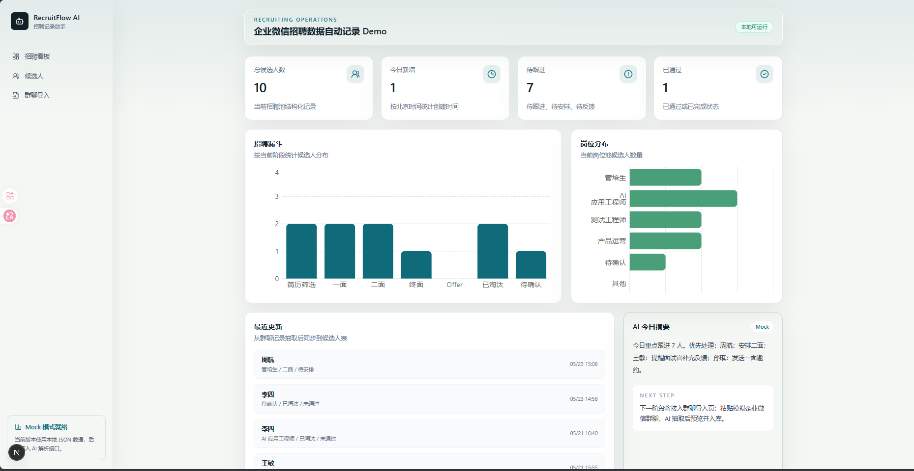
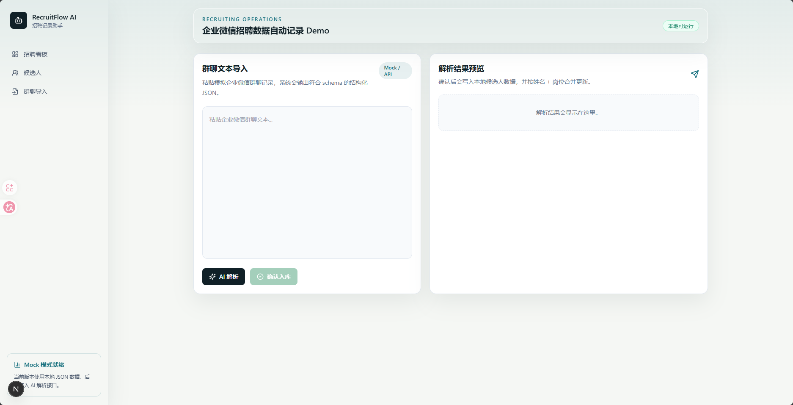
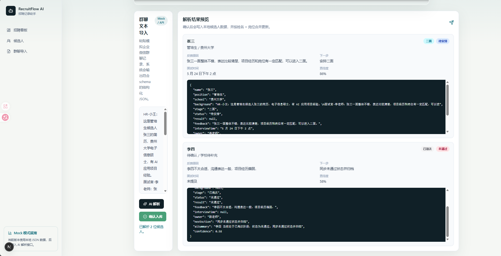
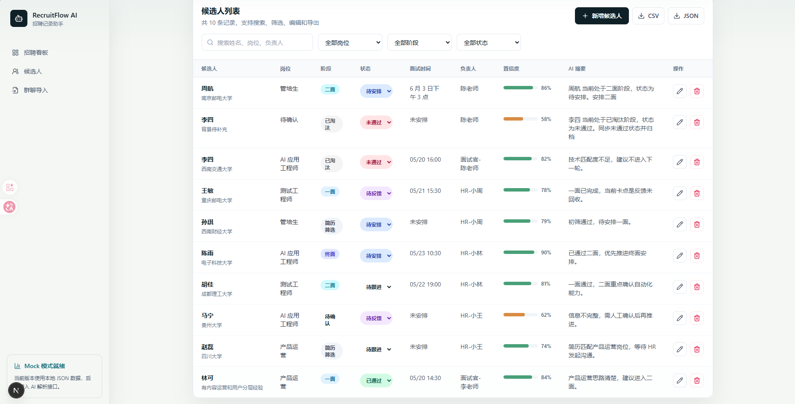
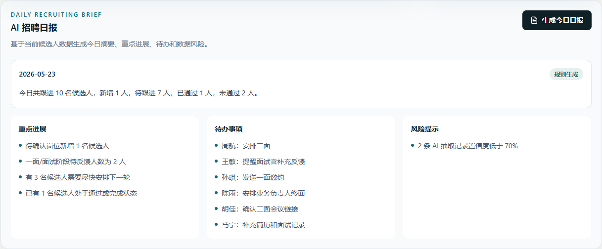

# RecruitFlow AI

RecruitFlow AI is a lightweight recruiting operations demo that turns chat-style hiring updates into structured candidate records, progress dashboards, exports, and daily recruiting summaries.

The project is designed around a common recruiting workflow: hiring updates are often scattered across internal chats, group messages, and shared spreadsheets. RecruitFlow AI demonstrates how an AI-assisted workflow can extract candidate information from unstructured text, normalize it into a consistent data model, and keep recruiting progress visible without manual spreadsheet maintenance.

## Features

- Chat text import for simulated recruiting group conversations
- AI-powered structured extraction with OpenAI-compatible APIs
- Mock extractor fallback when no API key is configured
- Candidate records with create, edit, delete, search, filter, and status updates
- Recruiting dashboard with stage funnel, position distribution, recent updates, and key metrics
- Daily recruiting report with summary, highlights, todos, and risks
- CSV and JSON export for spreadsheet-style downstream workflows
- Local JSON storage for simple local demos

## Demo Screenshots

### Dashboard



Shows recruiting progress, stage distribution, position distribution, and recent updates.

### Chat Import



Paste simulated recruiting chat text and run extraction.

### AI Extraction Result



Preview structured candidate data before confirming it into the local candidate list.

### Candidate List



Search, filter, edit, delete, and export candidate records.

### Daily Report



Generate a lightweight recruiting summary, todos, and risk reminders.

## Tech Stack

- Next.js 15
- React 18
- TypeScript
- Tailwind CSS
- Recharts
- Local JSON file storage
- OpenAI-compatible Chat Completions API

## Getting Started

### Prerequisites

- Node.js 18 or later
- npm 9 or later

Check your local versions:

```bash
node -v
npm -v
```

### Install

```bash
npm install
```

### Run Locally

```bash
npm run dev
```

Open:

```text
http://localhost:3000
```

Main routes:

```text
Dashboard:       http://localhost:3000
Chat Import:     http://localhost:3000/import
Candidate List:  http://localhost:3000/candidates
```

### Quality Checks

```bash
npm run typecheck
npm run build
npm run lint
```

## Environment Variables

RecruitFlow AI works without an API key by using the local mock extractor. To enable real LLM extraction, create `.env.local` in the project root:

```env
OPENAI_API_KEY=your_api_key
OPENAI_BASE_URL=https://api.openai.com/v1
OPENAI_MODEL=gpt-4o-mini
```

`OPENAI_BASE_URL` and `OPENAI_MODEL` are optional. They are useful when using OpenAI-compatible providers.

Do not commit `.env.local`.

## Demo Flow

1. Open the dashboard to view recruiting metrics and charts.
2. Go to Chat Import.
3. Paste chat-style recruiting text.
4. Click AI extraction.
5. Review structured candidate records.
6. Confirm records into the candidate list.
7. Search, filter, edit, or delete candidates.
8. Export CSV or JSON.
9. Return to the dashboard and generate the daily recruiting report.

Example input:

```text
HR-小王：这是管培生候选人张三的简历，贵州大学电子信息硕士，有 AI 应用项目经验。
面试官-李老师：张三一面整体不错，表达比较清楚，项目经历和岗位有一定匹配，可以进入二面。
HR-小王：收到，我安排他 5 月 24 日下午 2 点二面。
```

## Data Storage

The demo stores candidate data in:

```text
data/candidates.json
```

When the file is empty, the dashboard falls back to built-in mock data so that the UI is meaningful immediately after startup. Once records are confirmed from the import page, the app writes them into the local JSON file.

This storage approach is intended for local demos. A production implementation should use a database and proper concurrency control.

## Architecture

```text
Chat text
  -> Extractor API (/api/extract)
  -> LLM extractor or mock extractor
  -> Normalization layer
  -> Candidate API
  -> Local JSON store
  -> Dashboard, candidate list, reports, exports
```

The normalization layer keeps positions, stages, statuses, and confidence values consistent before data is used by the dashboard or reports.

## Scope

This project intentionally focuses on recruiting data recording and workflow visibility. It does not include:

- Real enterprise chat integration
- Real spreadsheet API synchronization
- Recruiting website scraping
- Candidate scoring or automated hiring decisions
- A full ATS or permission system

Those integrations can be added later on top of the current API boundaries.

## Deployment

The app can be deployed to Vercel:

1. Push this repository to GitHub.
2. Import the repository in Vercel.
3. Optionally configure `OPENAI_API_KEY`, `OPENAI_BASE_URL`, and `OPENAI_MODEL`.
4. Deploy.
5. Test chat import, candidate confirmation, dashboard updates, exports, and daily reports.

Without `OPENAI_API_KEY`, the deployed app uses mock extraction.

## License

MIT